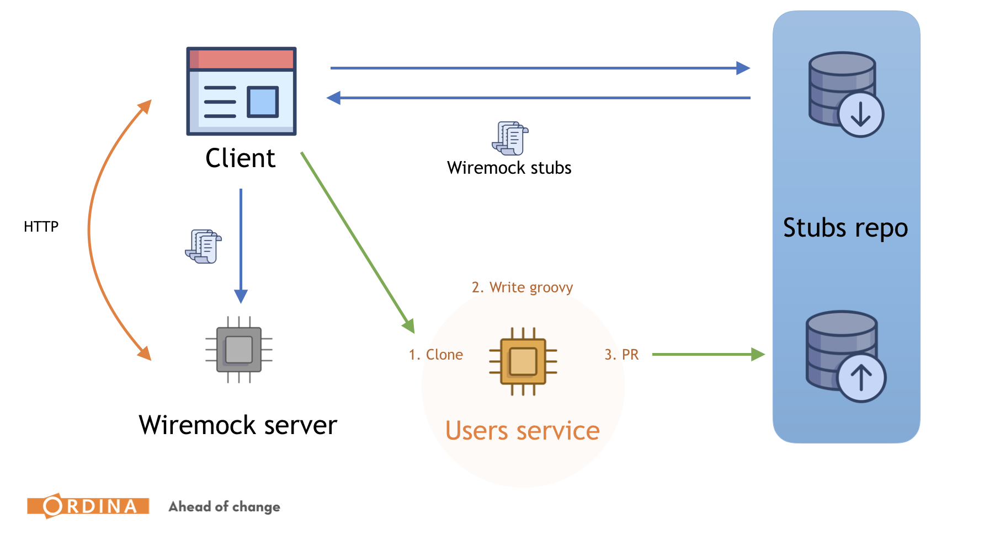
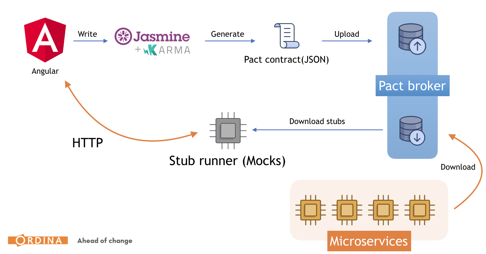

# Contract testing workshop: Spring cloud contract and Pact
Ordina Jworks hands-on workshop on consumer driven contract testing.



## Reference documentation
- [Martin Fowler on CDC](https://martinfowler.com/articles/consumerDrivenContracts.html)
- [Spring cloud contracts](https://cloud.spring.io/spring-cloud-contract/reference/html/index.html)
- [Contract DSL](https://cloud.spring.io/spring-cloud-contract/reference/html/project-features.html#contract-dsl)
- [HTTP Contracts](https://cloud.spring.io/spring-cloud-contract/reference/html/project-features.html#features-http)
- [Wiremock](http://wiremock.org/)
- [Pact](https://docs.pact.io/)
- [PactJS](https://github.com/pact-foundation/pact-js)

## Requirements
- BE: Java
- FE: Node & NPM & Angular CLI 

## Terminology
- Consumer: sends an HTTP request (or listen to a message from the queue - not covered)
- Producer: responds to an HTTP request (or publishes a message to the queue - not covered)
- Service: Backend service / microservice / backend client
- Frontend: Web app., Angular app., frontend client

## Pair up
Pair up in teams of 2. Make sure there is someone with backend knowledge, and someone with frontend knowledge.
Come up with a unique consumer name, and a unique producer name and use these names as the basepath for your urlpath in contracts

## Repositories
- [sanda-tournaments](https://github.com/ordina-jworks/cdc-sanda-tounaments)
- [sanda-registrations](https://github.com/ordina-jworks/cdc-sanda-registrations)
- [sanda-registrations-client](https://github.com/ordina-jworks/cdc-sanda-registrations-client)

## HTTP Contracts with Spring Cloud Contracts
### Assignment 1: A frontend consumer and a REST backend provider

Consumer: Registration app.
Provider: Sanda-registrations service.

> As a user, I want to register myself for an upcoming tournament so I can participate in it.
>
> A user needs to fill in his
> - email 
> - weight
> - birthDate
> - name
> - firstName
> - clubName
> - gender (m/f)
> 
> And provide the tournament to register for.
>
> Make contracts for a successful request (user registered), and an unsuccessful request (not registered, missing required field, f.e. name), also make a contract to get a list of upcoming tournaments.

Write on a paper or in a note taking app a contract for the above feature. 
Come to an agreement on how the consumer and provider are going to communicate with each other.

Make sure to define the following:

- the path of the request
- the HTTP method of the request
- potential request headers
- potential query parameters in the request
- the JSON structure of the request body
- the JSON structure of the response body
- the HTTP status code of the response
- potential response headers.

Keep this document as a reference for later.

### Assignment 2: A REST backend provider and a frontend consumer: Write the contracts in Spring Cloud Contract
#### Task 1(Consumer/Producer does not have to be here but help is appreciated): Create the contract on the producer side.
Consumer driven, does not mean consumer owned.
Contracts remain with the producer in Spring cloud contracts.

1. Fork and clone the cdc-sanda-registrations service (producer)
2. Create the groovy contracts based on the definition you created in the first assignment.
([HTTP Contract DSL Documentation](https://cloud.spring.io/spring-cloud-contract/reference/html/project-features.html#features-http))
3. When you are ready create a PR in the producer repository.
4. Generate the stubs for the consumer by running ```mvn clean install –DskipTests``` 
or with the spring cloud contracts maven plugin and the ```convert``` task.
5. You can find the generated stubs inside the **target/stubs/.../mappings** folder

#### Task 2(consumer): Write the missing consumer implementation 
While the PR is open, the consumer can start with the implementation using the generated stubs.

1. Clone the cdc-sanda-registrations-client project (consumer)
2. Put the generated stubs from the previous task inside the **wiremock/mappings** folder
3. Run wiremock: **npm run wiremock**
4. Write integration tests for all the contracts in the **src/test/scc/sanda-registrations/** folder
5. Implement the registration feature using the mock server

#### Task 2(producer): Write the missing producer implementation 
As a producer, you can finish your other work first. But once you have time, you need to take over the PR. Provide feedback, make corrections, etc. Once you are ready, start writing the missing producer implementation.

1. Clone/open the cdc-sanda-registrations service (producer)
2. Create and configure your base testing class
3. Run maven clean + install
4. An integration test has been generated, write the missing implementation.

### Assignment 3(consumer/producer): A REST backend consumer and a REST backend provider.

> As the sanda registrations service, I want to get a list of tournaments for the current or upcoming competition year.
> A competition year starts from 1 september until 30 june.
> I want to receive the name, startdate and max # of participants

Write on paper or in a note taking app a contract for the above feature. Come to an agreement on how the
consumer and provider are going to communicate with each other.

Make sure to define the following:

- the path of the request
- the HTTP method of the request
- potential request headers
- potential query parameters in the request
- the JSON structure of the request body
- the JSON structure of the response body
- the HTTP status code of the response
- potential response headers.

Keep this document as a reference for later.

### Assignment 4: A REST backend consumer and a REST backend provider: Write the contracts in Spring Cloud Contract
#### Step 1(consumer/producer): Create the contracts on the producer side.

1. Clone the cdc-sanda-tournaments project (producer)
2. Create the groovy contracts based on the definition you created in the previous assignment.
([HTTP Contract DSL Documentation](https://cloud.spring.io/spring-cloud-contract/reference/html/project-features.html#features-http))
3. When you are ready create a PR in the producer repository.
4. Generate the stubs for the consumer by running ``` mvn clean install –DskipTests```

#### Step 2(b.e. consumer): Write the missing consumer implementation

1. Open the cdc-sanda-registrations project (consumer)
2. Write the missing consumer implementation (you know how the API will look like)
3. Assume the producer application runs on http://localhost:1234
4. Write your integration tests
5. Your tests will fail because your requests are not being sent to a real instance
6. Install the spring-cloud-stub-runner
7. Autoconfigure your testclass with the @AutoConfigureStubRunner annotation
    - Download stubs jar from maven local
    - Get the JAR using the coördinates from the sanda-tournaments producer
    - Get the latest version
    - Start on port 1234

#### Step 3(producer): Write the missing producer implementation

1. Clone/open the sanda-tournaments service (producer)
2. Create and configure your base testing class
3. Run maven clean + install
4. An integration test has been generated, write the missing implementation and make sure the test passes.

### Assignment 5: A consumer driven contract flow with Pact: A front-end client and a backend service.

#### Step 1(consumer): Write the integration test in the frontend client.
Contracts are generated by successful integration test in the consumer project.

**MAKE SURE YOU USE YOUR TEAM'S PROVIDER AND CONSUMER NAME, THE ARTIFACTID SHOULD MATCH BACKEND PRODUCER**

1. Open the sanda-registration-client project (consumer)
2. Add PactJS
```
    "@pact-foundation/karma-pact": "2.2.0",
    "@pact-foundation/pact-node": "9.0.2",
    "@pact-foundation/pact-web": "9.1.0",
```
3. Configure Karma
    1. Add pact to frameworks
    2. Add 'require('@pact-foundation/karma-pact')' to plugins
    3. Configure your mock server by adding the next snippet in your karma config.
```
   pact: [{
      port: 1234,
      log: path.resolve(process.cwd(), 'logs', 'pact.log'),
      dir: path.resolve(process.cwd(), 'pacts'),
    }],
```
4. Create your integration test (Look at the slides for an example pact test)
5. Run your tests
6. When your tests are successful, you should have a folder **/pacts** in the root folder of your project. If they are unsuccessful, you can find detailed information in the **/logs** folder
7. You can publish your pact files to our Pact broker (https://jworks-ordina-pact-broker.herokuapp.com/). Just run the ```npm run pact:publish``` script.
8. To run the pact files in a stub runner for local development against a mock API, follow these instructions: https://docs.pact.io/getting_started/stubs#cli-tools
9. Implement the consumer implementation


#### Step 2(producer): Get pact files from the pact broker

The contracts are no longer on the producer side. Instead, consumer generates them from tests. The producer connects to the pact broker, fetches the contracts and loads them into the spring cloud verifier.

For some reading material, have a look at: https://ordina-jworks.github.io/spring/2018/04/28/Spring-Cloud-Contract-meet-Pact.html and https://docs.pact.io

1. Open the cdc-sanda-registrations project (producer)
2. Configure the contracts repository url: ```https://jworks-ordina-pact-broker.herokuapp.com/```
3. Configure Basic Authentication (ask for credentials)
4. Set contracts mode to REMOTE
5. Now you should be able to download contracts and generate tests.
6. Make sure all the tests pass on the consumer side
